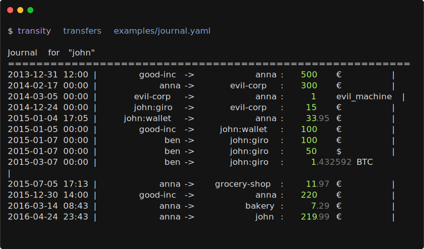
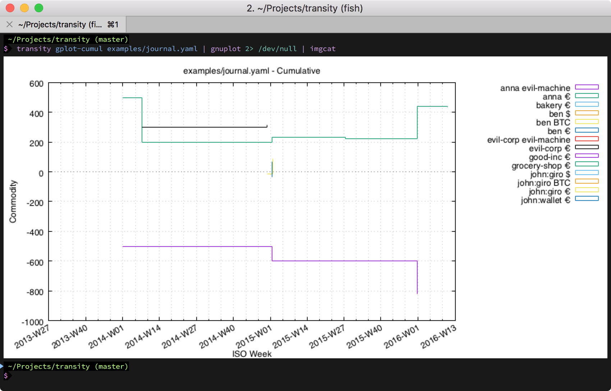

## Usage

Plain text accounting means tracking finances in human-readable text files
rather than in a database or proprietary software.
Your financial data is stored as a simple YAML journal file
that you edit with any text editor and process with command line tools.

This makes your data version-controllable, diffable, scriptable,
and fully under your control.
No lock-in, no opaque formats, no required GUI.


### Journal File Format

A minimal journal file is a YAML file with following format:

```yaml
owner: anna
config:
  separator: ':'
commodities:
  - id: €
    name: Euro
    alias:
      - EUR
    note: Currency used in the European Union
    utc: '2017-04-02 19:33:53'

entities:
  - id: anna
    name: Anna Smith
    utc: '2017-04-02 19:33:28'
    tags:
      - person
    accounts:
      - id: wallet
        name: Wallet
        note: Anna's black wallet
        utc: '2017-04-02 19:33:28'
        tags:
          - wallet

  - id: evil-corp
    name: Evil Corporation
    utc: '2017-04-02 19:33:28'
    note: The Evil Corporation in the United States of Evil
    tags:
      - company

transactions:
  - title: Purchase of evil machine
    transfers:
      - utc: '2017-02-17'
        from: anna
        to: evil-corp
        amount: 50000 €
      - utc: '2017-02-17'
        from: evil-corp
        to: anna
        amount: 1 evil-machine
```


### Account Separator

Account IDs use a hierarchy separator to distinguish the entity
from the account name (e.g. `anna:wallet`).

When no separator is configured, both `:` and `/` are accepted
and automatically normalized to `/`.
This means `anna/wallet` and `anna:wallet` are equivalent.

You can set a custom separator in the journal file under `config`:

```yaml
owner: anna

config:
  separator: "|"

entities:
  - id: anna
    accounts:
      - id: wallet

transactions:
  - transfers:
      - utc: '2024-01-15'
        from: anna|wallet
        to: shop|cash
        amount: 42 €
```

When a separator is explicitly configured, **only** that character is
treated as a hierarchy separator.
Other characters (like `:` when the separator is `/`)
are treated as literal parts of the account name.
The separator must be exactly one character.


### Analyzing Journal Files

#### Balance

```shell
$ transity balance examples/journal.yaml
          anna       1        evil-machine
                -49978.02     €
           ben     -50        $
                    -1.432592 BTC
                  -100        €
     evil-corp      -1        evil-machine
                 50015        €
      good-inc    -100        €
  grocery-shop      11.97     €
  john             371.04     €
                    50        $
                     1.432592 BTC
      :default     219.99     €
          giro      50        $
                     1.432592 BTC
                    85        €
        wallet      66.05     €
```

If linked modules aren't exposed in your path you can also run

```shell
cli/main.js balance examples/journal.yaml
```


#### Help

List complete usage manual by simply calling `transity` without any arguments.

```shell
$ transity

Usage: transity <command> <path/to/journal.yaml>

Command             Description
------------------  ------------------------------------------------------------
balance             Simple balance of all accounts
transactions        All transactions and their transfers
transfers           All transfers with one transfer per line
entries             All individual deposits & withdrawals
entries-by-account  All individual deposits & withdrawals grouped by account
gplot               Code and data for gnuplot impulse diagram
                    to visualize transfers of all accounts
gplot-cumul         Code and data for cumuluative gnuplot step chart
                    to visualize balance of all accounts
```


#### Transfers




#### Plotting

By default all accounts are plotted.
To limit it to only a subsection use `awk` to filter the output.

For example all transactions of Euro accounts:

```bash
transity gplot examples/journal.yaml \
| awk '/^$/ || /(EOD|^set terminal)/ || /€/' \
| gnuplot \
| imgcat
```

Or all account balances of Euro accounts over time:

```bash
transity gplot-cumul examples/journal.yaml \
| awk '/^$/ || /(EOD|^set terminal)/ || /€/' \
| gnuplot \
| imgcat
```




### Scripts

Useful scripts leveraging other command line tools.

#### Check Order of Entries

Check if all entries are in a chronological order

```sh
ag --nonumbers "^    utc:" journals/main.yaml | tr -d "\'" | sort -c
```


### Tutorials

- [cs007.blog] - Personal finance for engineers.
- [principlesofaccounting.com] - Online tutorial on accounting.

[cs007.blog]: https://cs007.blog
[principlesofaccounting.com]: https://www.principlesofaccounting.com
