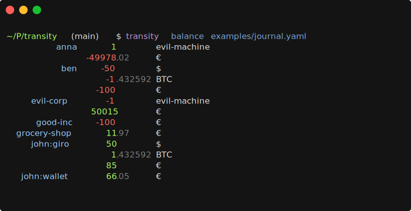

# Transity Documentation

The [plain text accounting] tool of the future.
Keep track of your 💵, 🕘, 🐖, 🐄, 🍻 on your command line.

[plain text accounting](https://plaintextaccounting.org)

Also check out the [playground](/) on the landing page!

For help or feature requests,
please visit our [GitHub Discussions] page!

[GitHub Discussions]: https://github.com/feramhq/Transity/discussions
