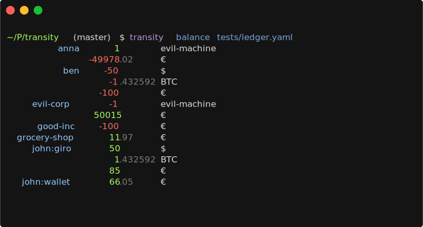
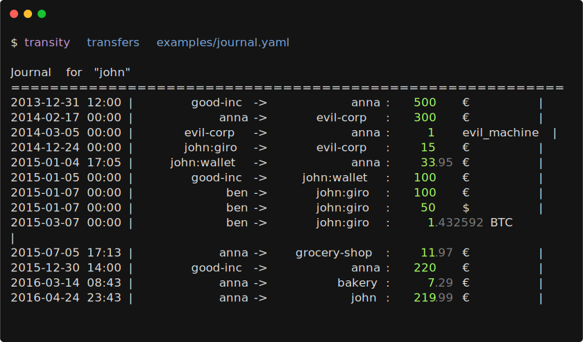
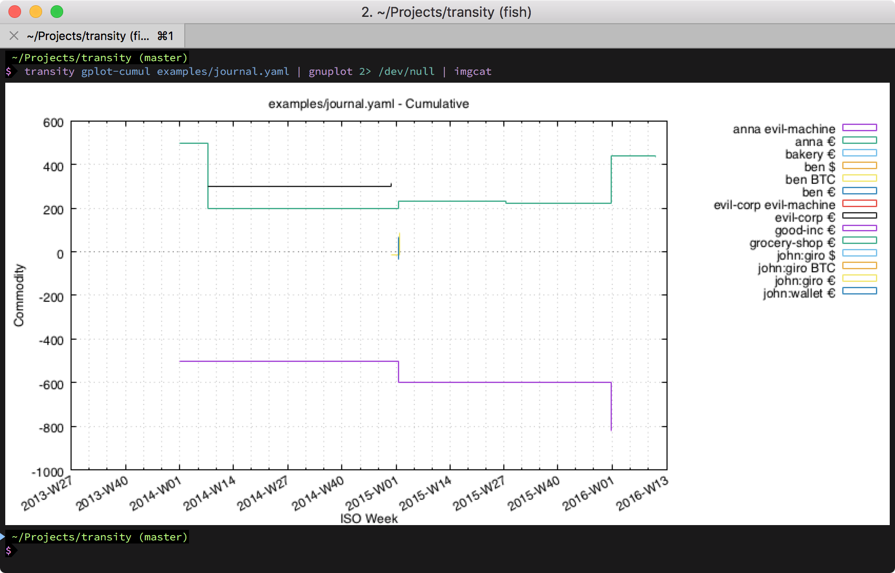

# Transity

[![Build Status][]][travis]
[![Join irc.freenode.net on IRCCloud][]][irccloud]
[](https://gitter.im/feramhq/transity?utm_source=badge&utm_medium=badge&utm_campaign=pr-badge&utm_content=badge)

The plain text accounting tool of the future.
Keep track of your 💵, 🕘, 🐖, 🐄, 🍻 on your command line.

[Build Status]: https://travis-ci.com/feramhq/transity.svg?token=ipYeEBNjb9wCxCwPq6aS&branch=master
[travis]: https://travis-ci.com/feramhq/transity

[Join irc.freenode.net on IRCCloud]: https://img.shields.io/badge/IRC-%23transity-1e72ff.svg?style=flat
[irccloud]: https://www.irccloud.com/invite?channel=%23transity&amp;hostname=irc.freenode.net&amp;port=6697&amp;ssl=1



<!-- toc -->

- [List of Features / TODOs](#list-of-features--todos)
- [Installation](#installation)
- [License](#license)
- [Usage](#usage)
  * [Check Order of Entries](#check-order-of-entries)
  * [Retrieving Data from Banks](#retrieving-data-from-banks)
    + [Script Usage](#script-usage)
- [Journal File Format](#journal-file-format)
- [Plotting](#plotting)
- [Import from Ledger CLI](#import-from-ledger-cli)
- [FAQ](#faq)
  * [Why another plain text accounting tool?](#why-another-plain-text-accounting-tool)
  * [Why is it written in PureScript?](#why-is-it-written-in-purescript)
  * [Why is it not written in Haskell?](#why-is-it-not-written-in-haskell)
- [Comparison with Hledger](#comparison-with-hledger)
  * [Syntax](#syntax)
  * [Reporting](#reporting)
  * [Missing features](#missing-features)
  * [Performance](#performance)
- [Ideas](#ideas)
  * [Entry / Value Date](#entry--value-date)
  * [Syntax](#syntax-1)
- [Related](#related)

<!-- tocstop -->

## List of Features / TODOs

- [x] Modeled on transactions instead of debiting / crediting accounts
  => Support for complex transactions made up of several transfers
- [x] Dedicated payer (from) and payee (to) fields (ledger only supports payee)
- [x] No misuse of accounts as categories / tags => direct support for them
- [ ] No hard-coded asset / liability connotation as it is viewpoint dependent
  => Choose viewpoint when printing the balance
- [x] Easily editable & processable file format based on [YAML]
- Clear separation between
  - [x] Physical account (e.g. wallet, bank account)
  - [x] Entities (e.g. my mum, a company)
  - [ ] Purpose of transaction (food, travel)
- [x] Initial balances
- [x] High precision timestamps
  - [ ] Including nanoseconds
- [x] BigInt rational numbers to eliminate rounding errors
- [ ] Support for all states of transaction life cycle
  1. Request - Request to exchange a commodity
  1. Offer - Specification of commodity & expected trade item
  1. Acceptance - Affirmation of interest in offered exchange
  1. Fulfillments
  1. Certification - Acknowledgment that exchange was performed
- [ ] Support for any type of commodity (e.g. even time and messages)
- [ ] Differentiation between transfers, transactions & exchanges
  - [ ] Special syntax for exchanges
- [ ] Meta data for all entities (transactions, accounts, entities, …)
- [x] Verifies sole use of predefined entities
- [x] Checks match with verification balances
- [ ] Duplicate detection
- [ ] Syntax checking in addition to syntax highlighting
- [ ] CSV import
- [ ] Link to receipt file
- [ ] Dashboard
- [ ] Budgets (including progress visualization)
- Export to various formats for post-processing
  - [x] [Gnuplot] (for trends)
  - [ ] [Graphviz] (for account / entity relations)
  - [ ] [JS-Sequence-Diagrams] (sequence of transactions)
  - [x] [(H)ledger Format] (for using (H)ledger exclusive features)
- Additional features for crypto currencies
  - TODO: Think about what features exactly
- [ ] Multi file support
- [ ] Cache-files to speed up processing of large data sets
- [ ] Support for time limited commodities (e.g. subscription for a month)
- Commodities
  - [ ] Treat as scientific units (e.g 1 k€ == 1000 €)
  - [ ] Hard vs Soft vs Fungible vs …
  - [ ] Define which are allowed / prohibited for each account
- [ ] Generate EPC QR Codes for transfers

[YAML]: http://yaml.org
[Gnuplot]: http://www.gnuplot.info
[Graphviz]: https://graphviz.org
[JS-Sequence-Diagrams]: https://bramp.github.io/js-sequence-diagrams
[(H)ledger Format]: http://hledger.org/journal.html


## Installation

Transity is distributed as a JavaScript bundle and can therefore
be installed via [npm](https://npmjs.com):

```sh
npm install --global transity
```


## License

While Transity is licensed under the AGPL-3.0-or-later
and can therefore be used free of charge,
I hope you will acknowledge the work and effort
it takes to maintain and improve this software
and make a donation via my [GitHub Support page].

If you find Transity valuable and/or use it regularly this should
be a small nuisance for you, but it would mean the world for me!
It would mean that I can spend more time on this project
and bring it to the next level!

Thanks a lot for your support!

For including Transity in proprietary closed source products, please contact me!

[GitHub Support page]: https://github.com/sponsors/ad-si


## Usage

```shell
$ transity balance examples/journal.yaml
          anna       1        evil-machine
                -49978.02     €
           ben     -50        $
                    -1.432592 BTC
                  -100        €
     evil-corp      -1        evil-machine
                 50015        €
      good-inc    -100        €
  grocery-shop      11.97     €
  john             371.04     €
                    50        $
                     1.432592 BTC
      :default     219.99     €
          giro      50        $
                     1.432592 BTC
                    85        €
        wallet      66.05     €
```

If linked modules aren't exposed in your path you can also run

```shell
cli/main.js balance examples/journal.yaml
```


List complete usage manual by simply calling `transity` without any arguments.

```shell
$ transity

Usage: transity <command> <path/to/journal.yaml>

Command             Description
------------------  ------------------------------------------------------------
balance             Simple balance of all accounts
transactions        All transactions and their transfers
transfers           All transfers with one transfer per line
entries             All individual deposits & withdrawals
entries-by-account  All individual deposits & withdrawals grouped by account
gplot               Code and data for gnuplot impulse diagram
                    to visualize transfers of all accounts
gplot-cumul         Code and data for cumuluative gnuplot step chart
                    to visualize balance of all accounts
```




### Check Order of Entries

Check if all entries are in a chronological order

```sh
ag --nonumbers "^    utc:" journals/main.yaml | tr -d "\'" | sort -c
```


### Retrieving Data from Banks

Transity includes a few scripts located at [./scripts](./scripts) to
automate a Chrome browser to download data.
It supports downloading CSV files of all
transactions and converting them to journal
files and retrieving the current account balance:

Currently supported accounts for transactions:

- [DKB Visa Card](https://dkb.de)
- [DKB Giro Account](https://dkb.de)
- [HypoVereinsbank](https://www.hypovereinsbank.de)
- [MBS](https://mbs.de)

Currently supported accounts for balances:

- [AWS](https://aws.amazon.com)
- [DKB](https://dkb.de)
- [Fidor](https://fidor.de)
- [Finvesto](https://finvesto.de)
- [HypoVereinsbank](https://www.hypovereinsbank.de)
- [MBS](https://mbs.de)
- [PayPal](https://paypal.com)
- [Deutsche Post Petty Cash](https://portokasse.deutschepost.de)

Contributions are very welcome!


#### Script Usage

```sh
node scripts/transactions/hypovereinsbank.js > transactions.yaml
```

This will prompt you for your credentials and afterwards automate
a headless Chrome instance to download and convert the data.


## Journal File Format

A minimal journal file is a YAML file with following format:

```yaml
owner: anna
commodities:
  - id: €
    name: Euro
    alias:
      - EUR
    note: Currency used in the European Union
    utc: '2017-04-02 19:33:53'

entities:
  - id: anna
    name: Anna Smith
    utc: '2017-04-02 19:33:28'
    tags:
      - person
    accounts:
      - id: wallet
        name: Wallet
        note: Anna's black wallet
        utc: '2017-04-02 19:33:28'
        tags:
          - wallet

  - id: evil-corp
    name: Evil Corporation
    utc: '2017-04-02 19:33:28'
    note: The Evil Corporation in the United States of Evil
    tags:
      - company

transactions:
  - title: Purchase of evil machine
    transfers:
      - utc: '2017-02-17'
        from: anna
        to: evil-corp
        amount: 50000 €
      - utc: '2017-02-17'
        from: evil-corp
        to: anna
        amount: 1 evil-machine
```


## Plotting

By default all accounts are plotted.
To limit it to only a subsection use `awk` to filter the output.

For example all transactions of Euro accounts:

```bash
transity gplot examples/journal.yaml \
| awk '/^$/ || /(EOD|^set terminal)/ || /€/' \
| gnuplot \
| imgcat
```


Or all account balances of Euro accounts over time:

```bash
transity gplot-cumul examples/journal.yaml \
| awk '/^$/ || /(EOD|^set terminal)/ || /€/' \
| gnuplot \
| imgcat
```




## Import from Ledger CLI

Execute the included ledger2transity script:

```shell
./ledger2transity.sh examples/hledger.journal > transactions.csv
```

Convert `transactions.csv` to YAML with e.g. [browserling.com/tools/csv-to-yaml]

[browserling.com/tools/csv-to-yaml]: https://browserling.com/tools/csv-to-yaml


**Attention:**

- Merge adjacent entries as each entry only debits / credits an account.
  A transaction always involves 2 accounts (`from` and `to`).
  (For expenses basically copy the ledger-account from the second entry
  into the `from` field of the first entry)
- `from` and `to` might be reversed for income
  (depending on how the `payee` field was used)
- Account names of Ledger-CLI are interpreted as tags
  Transity understands accounts as **physical accounts**
- The note is duplicated in the `tags` field.
  There is no way to get only the tags in Ledger-CLI 😔


## FAQ

### Why another plain text accounting tool?

Existing accounting tools are historically based on the notion of an account.
You add money (debit) and you remove money (credit).
(If this sounds backwards to you, read [this explanation])

[this explanation]:
  http://simplerestaurantaccounting.com/debit-and-credit-accounting-terminology-is-confusing

For example you get 50 € from your mum and buy some food for 20 €.

```txt
Account | Debit   | Credit
--------|---------|--------
Wallet  | 50.00 € |
Wallet  |         | 20.00 €
---------------------------
```

Simple, but also incomplete.
Where did the money come from, where did it go?
This led to double entry bookkeeping.
Whenever you add some money to an account,
you have to remove the same amount from another.


```txt
Account | Debit   | Credit
--------|---------|--------
Wallet  | 50.00 € |
Mum     |         | 50.00 €
Wallet  |         | 20.00 €
Food    | 20.00 € |
---------------------------
```

But you *must never forget a posting*,
because otherwise your account won't balance.

```txt
Account | Debit   | Credit
--------|---------|--------
Wallet  | 50.00 € |
Mum     |         | 50.00 €
Wallet  |         | 20.00 €
---------------------------
```

Oops, where did the money go? 🤷‍

If this looks (and sounds) confusing or too complicated, you're not alone!
It made sense in former times as this layout makes it easier
to add up the amounts by hand, but not in times of computers.

So how can we simplify it?
It's actually quite easy:
We just have to model it in terms of transactions, and not accounts.

```txt
Amount | From   | To
-------|--------|--------
50 €   | Mum    | Wallet
20 €   | Wallet | Food
-------------------------
```

- Simple - No more confusing debit / credit / asset / liability mumbo jumbo
- Intuitive - Just like you would talk about it
- Safe - It's obvious if you forget to fill out a field

Together with some further changes it yields an
**easier to understand, more robust and more complete**
representation of accounting!


### Why is it written in PureScript?

PureScript leverages strong static typing and can therefore
give more guarantees about the functionality of the code
than weakly typed or untyped languages (like JavaScript).

You wouldn't want your money to get lost in rounding errors or
be turned to `undefined`, would you? 😉


### Why is it not written in Haskell?

PureScript can also easily be used in the browser or get deployed
as a cloud function as it simply compiles to JavaScript.
With Haskell you'd have to use another language for a web frontend
or quarrel with experimental stuff like [GHCJS].

[GHCJS]: https://github.com/ghcjs/ghcjs


## Comparison with Hledger

(H)ledger's transactions are a (balanced) group of account postings.
Transity's transactions are a group of transfers between two accounts.


### Syntax

Checkout the files [hledger.journal] and [journal.yaml]
for similar transactions modeled in Hledger and in Transity.

[hledger.journal]: ./examples/hledger.journal
[journal.yaml]: ./examples/journal.yaml


There is a lot of ambiguity in the ledger journal format.
Are you able to tell the difference between the 2 options?


```ledger
2019-01-17 Bought food
  expenses:food  $10
  assets:cash

; vs

2019-01-17 Bought food
  assets:cash
  expenses:food  $10
```

Also, it lacks some fields for more precise recording
of which parties where involved.

- What food?
- Where did you buy it?
- Which supermarket?

```ledger
2019-01-17 Bought food
  expenses:food  $10
  assets:cash
```

### Reporting

```shell
hledger --file examples/hledger.journal balance
# vs
transity balance examples/journal.yaml
```

```shell
hledger --file examples/hledger.journal register
# vs
transity transactions examples/journal.yaml
```

```shell
hledger --file examples/hledger.journal register --output-format=csv
# vs
transity entries examples/journal.yaml
```


### Missing features

- No support for precise timestamps (transactions only have an associated date)
- No first class support for Gnuplot
  (Check out [Report Scripts for Ledger CLI with Gnuplot] for some scripts)

[Report Scripts for Ledger CLI with Gnuplot]:
  https://www.sundialdreams.com/report-scripts-for-ledger-cli-with-gnuplot


### Performance

Measured with hyperfine including 3 warmups on an early 2015 MacBook Pro.

*For a journal file with around 2000 entries:*

Transity:
```txt
Benchmark #1: transity balance journals/main.yaml
  Time (mean ± σ):      1.287 s ±  0.021 s    [User: 1.790 s, System: 0.140 s]
  Range (min … max):    1.250 s …  1.324 s    10 runs
```

Hledger:
```txt
Benchmark #1: hledger -f test.ledger balance
  Time (mean ± σ):     409.6 ms ±   6.1 ms    [User: 366.6 ms, System: 28.5 ms]
  Range (min … max):   398.8 ms … 417.6 ms    10 runs
```

Ledger:
```txt
Benchmark #1: ledger -f test.ledger balance
  Time (mean ± σ):      76.3 ms ±   9.1 ms    [User: 62.7 ms, System: 9.4 ms]
  Range (min … max):    65.1 ms … 101.8 ms    28 runs
```


## Ideas

### Entry / Value Date

There are no separate fields for entry or value dates necessary.
Simply use ISO 8601 [time intervals] to specify the duration of a transfer.

[time intervals]: https://en.wikipedia.org/wiki/ISO_8601#Time_intervals

```yaml
transactions:
  - id: '123456789'
    note: Deposit of savings
    transfers:
      - utc: 2018-01-04T12:00--05T22:10
        from: john
        to: bank
        amount: 100 €
```


### Syntax

This is a first concept for an alternative syntax for the YAML journal file:

```transity
2016-04-16 18:50:28
#20135604
1 year registration of domain "example.org"
john      -> paypal    :  9.95 €
paypal    -> namecheap : 10.69 $
paypal    -> icann     :  0.18 $
namecheap -> john      :  1    Domain
```


## Related

- [plaintextaccounting.org] - Best of plain text accounting.
- [cs007.blog] - Personal finance for engineers.
- [principlesofaccounting.com] - Online tutorial on accounting.
- [npoacct.sfconservancy.org] -
    Effort to create accounting software for non-profit organizations.
- [github.com/nuex/t] - sh script for working with ledger timelog files.
- [github.com/bankscrap/bankscrap] -
    Ruby gem to extract balance and transactions from multiple banks.
- [github.com/prashants/webzash] -
    Easy to use web based double entry accounting software.

[plaintextaccounting.org]: http://plaintextaccounting.org
[cs007.blog]: https://cs007.blog
[principlesofaccounting.com]: http://principlesofaccounting.com
[npoacct.sfconservancy.org]: https://npoacct.sfconservancy.org
[github.com/nuex/t]: https://github.com/nuex/t
[github.com/bankscrap/bankscrap]: https://github.com/bankscrap/bankscrap
[github.com/prashants/webzash]: https://github.com/prashants/webzash
