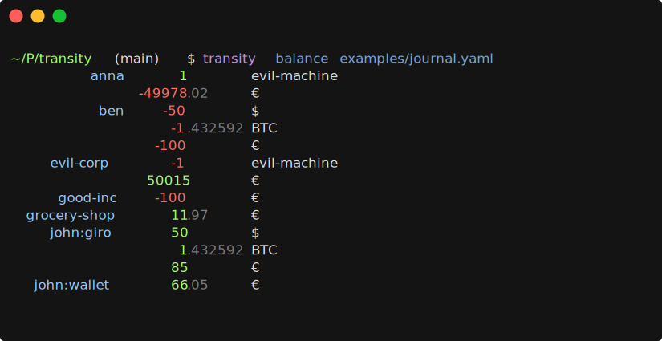

# Transity

The plain text accounting tool of the future.
Keep track of your 💵, 🕘, 🐖, 🐄, 🍻 on your command line.

Check out the official [documentation] for more information.

For help, please come visit us on our [GitHub Discussions] page!

[documentation]: https://transity.ad-si.com/docs/
[GitHub Discussions]: https://github.com/feramhq/Transity/discussions
